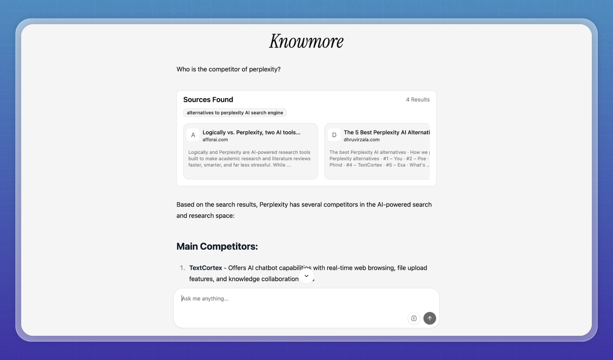

# Knowmore

**Knowmore** is a clone of Perplexity AI, it has a lot of thing missing features. The goals for this project is to learn django and RAG architecture.

<div style="display: flex; gap: 25px; align-items: center;">
  
  
</div>

## Requirements

- Python >= 3.10
- Node.js/Bun
- Docker (optional)

**Environment Variables**:

```bash
ANTHROPIC_API_KEY=
OPENAI_API_KEY=
FIRE_CRAWL_API_TOKEN=
```

## Integration

For now it integrates with Anthropic AI. Soon will be adding OpenAI GPT-4 and other LLMs.

## Quick Start

### Using Make (Recommended)

Build and run the full application:
```bash
make dev
```

This will:
- Build the frontend using `./build_frontend.sh`
- Build the Docker image
- Run the backend on port 7000

Individual commands:
```bash
# Build frontend and backend
make build

# Serve frontend only (for development)
make serve-ui

# Build Docker image only
make backend

# Run backend container only
make run-backend
```

### Manual Setup

Install Python packages:
```bash
pip install -r requirements.txt
```

Install frontend dependencies:
```bash
cd frontend && bun install
```

Run Python server:

For development (no streaming support):
```bash
python manage.py runserver
```

For proper SSE streaming support (recommended):
```bash
python run_asgi.py
# or
daphne -b 127.0.0.1 -p 8000 Knowmore.asgi:application
```

### Using Docker

Build Docker image:
```bash
docker build . -t knowmore
```

Run Docker container:
```bash
docker run --env-file .env -p 7000:8000 knowmore
```

Access the application at: http://localhost:7000

## Credits

This project is inspired by this company.

- [Devv AI](https://devv.ai/)
- [Perplexity](https://www.perplexity.ai/)
