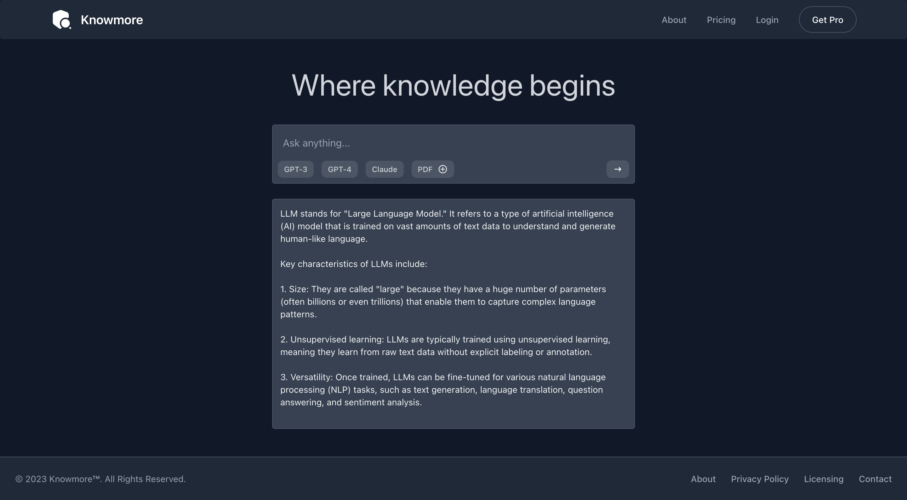

# Knowmore

**Knowmore** is a clone of Perplexity AI, it has a lot of thing missing features. The goals for this project is to learn django and RAG architecture.



## Requirement

- Python >= 3.9 
- Nodejs/bun

**ENV**:

```bash
ANTHROPIC_API_KEY=sk-ant-api...
```

## Integration

For know it integrate with Anthropic AI. Soon will be adding openai gpt4 and other LLM.

## Run

Install python packages.

```bash
pip install -r requirements.txt
```

Install npm dependencies.

```bash
npm install
```

Run python server.

```bash
python manage.py runserver
```

Using docker.

Build docker image.

```bash
docker build . -t knowmore-app
```

Ru docker image

```bash
docker run --env-file .env -p 7000:8000 knowmore-app:latest
```

Now visit.

http://localhost:7000

## Credits

This project is inspired by this company.

- [Devv AI](https://devv.ai/)
- [Perplexity](https://www.perplexity.ai/)
